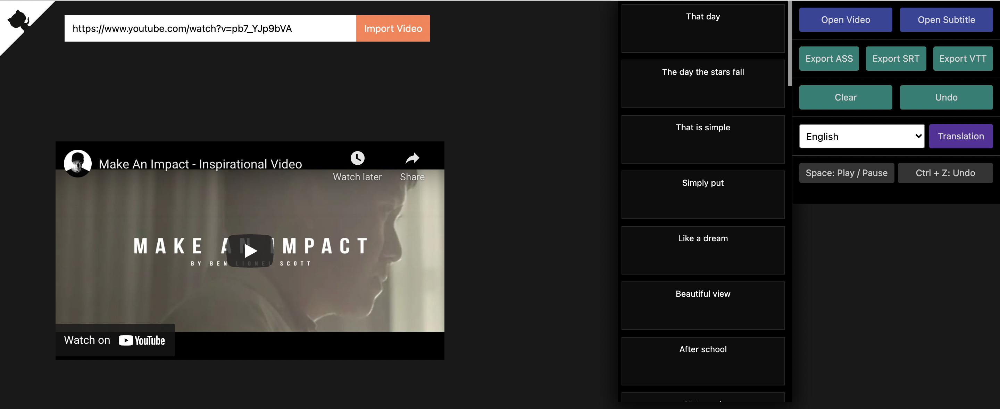

# SubPlayer

> SubPlayer is an online subtitle editor

Subplayer is online subtitle editor that helps in editing the subtitles. The videos can be imported both manually or by using youtube video link.

## Steps to run the app locally on your system:
1. Fork the repository.
2. Clone the repository by running `git clone https://github.com/{YOUR_USERNAME}/SubPlayer.git`
3. Go inside the directory and run `npm i`
4. Run `npm start`
5. Copy contents from .env.example file
5. Create .env file and add copied copied contents from .env.example into it
6. Add your youtube api key inside `REACT_APP_KEY`

Once the app is running locally, either import video by pressing Open Video button or by pasting the YouTube video url inside the top textbox.
You can preview and run the video.

This application supports translation only in Indian Languages and English.

